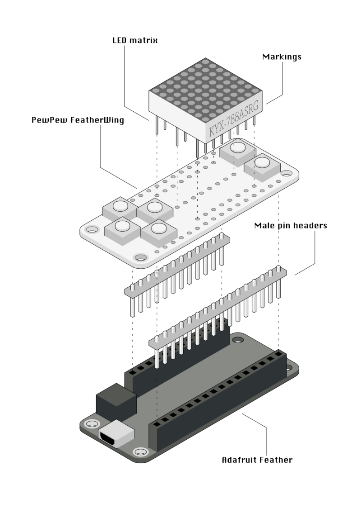

Assembly and Setup
******************

The PewPew FeatherWing comes without the pin headers and LED matrix attached,
so that some simple soldering is required before using it.

Basic Assembly
==============

The simplest way to assemble the PewPew board is to use an `Adafruit Feather
<https://www.adafruit.com/category/946>`_ board that supports CircuitPython (the
`Feather M0 Express <https://www.adafruit.com/product/3403>`_ works great for
this) with female pin headers, and to solder the male pin headers onto the
PewPew FeatherWing. Afterwards, insert the LED Matrix into place, solder its
pins from the bottom, and trim them with wire cutters.

Make sure to insert the LED Matrix in correct orientation -- with the markings
in the same direction as the "down" button. Otherwise the colors will be wrong,
and the image will be flipped.

Note that you should solder the pin headers first, and then solder the LED
matrix. Trying to do it in the opposite order may lead to damaging the matrix
with your soldering iron.

.. note:: The Adafruit Feather board is not included in the kit.

Making it Flatter
=================

The basic assembly is fine, but it's good 2cm thick. You can make the whole
thing much thinner by applying a number of tricks. First, use the `short female
pin headers <https://www.adafruit.com/product/2940>`_ for the Adafruit Feather.
Second, move the plastic on your male pin headers to the end of the header,
insert the header from the top, and try it with the Feather to see how long the
pins need to be. Then solder them, and trim the parts sticking out from the top
with wire cutters. This way the PewPew FeatherWing can sit right on top of the
battery plug of the Feather.

.. note:: Note that the short female headers are not included in the kit.

Optional Battery
================

To make the PewPew even more portable, you can add a small LiPO battery (`the
100mAh batteries <https://www.adafruit.com/product/1570>`_ are about the right
size). The FeatherWing even has a power switch built-in that you can use. Just
solder the battery leads to the two holes marked "+" for the red wire, and "-"
for the black wire. Be very careful to not short the battery wires while you
are doing that. Then you can use two-sided tape to stick the battery on the
underside of the FeatherWing, sandwiching it between the two boards. You may
need to add some electric tape to prevent the metal body of the battery from
shorting things on the boards.

.. note:: Note that the battery is not included in the kit.

Software Setup
==============

All the example programs are written using CircuitPython, so you will need to
get that running on your Feather board. Fortunately Adafruit provides a lot of
tutorials about how to do it. Some of the boards (like the M0 Express) even
come with CircuitPython already loaded on them. Please see
 `this guide <https://learn.adafruit.com/welcome-to-circuitpython/installing-circuitpython>`_.

Once you have CircuitPython running on the board, you need to copy the
``pew.mpy`` file to it. That's the main library that contains all the functions
needed to use the PewPew hardware.

In addition, you need to copy your program onto the board. You have to name it
``main.py`` for it to be started automatically on power-up. Later on we will
see how we can use a menu program that will let you choose what to run (you
have to rename the ``menu.py`` to ``main.py`` to have it run at start).

You can get all the files from the `project's repository
<https://github.com/deshipu/pewpew>`_, and the compiled files are available
from the `releases page <https://github.com/pewpew-game/pewpew/releases>`_.

