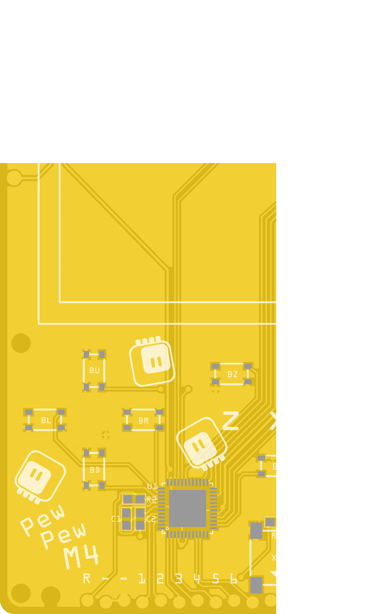
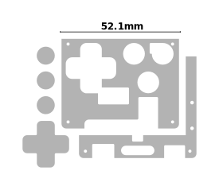
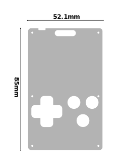

Assembly and Setup
******************

Electronics
===========

If you bought a kit, you will receive this part already assembled and programmed.

Schematic
---------

This is the schematic of the device.

.. image:: pewpew-m4-v8-schematic.svg
    :align: center
    :width: 100%

Printed Circuit Board
---------------------

A printed circuit board is necessary for assembling the electronic part of the
console. You can find the gerber files in the project's repository.

.. image:: pewpew-m4-v8-pcb-bottom.svg
    :width: 40%

If you need to make modifications to the PCB designs, the Fritzing file is also
available in the project's repository.

Bill of Materials
-----------------

You will need the following components:

+--------------------+-----------------------------------+--------+---------------------------------------------------------------------------------+
|Part/Designator     |Manufacture Part Number/Description|Quantity|Remarks/Links                                                                    |
+====================+===================================+========+=================================================================================+
|U1                  |ATSAMD51G19A-MU                    |1       |`Mouser <https://www.mouser.ch/ProductDetail/556-ATSAMD51G19AMU>`_               |
+--------------------+-----------------------------------+--------+---------------------------------------------------------------------------------+
|U2                  |ST7735R 1.8inch TFT                |1       |https://www.aliexpress.com/item/32818686437.html                                 |
+--------------------+-----------------------------------+--------+---------------------------------------------------------------------------------+
|U3                  |AP2112K-3.3TRG1 ldo                |1       |                                                                                 |
+--------------------+-----------------------------------+--------+---------------------------------------------------------------------------------+
|C1 C2               |10uF 0805 capacitor 3V             |2       |                                                                                 |
+--------------------+-----------------------------------+--------+---------------------------------------------------------------------------------+
|R1                  |10Ohm 0805 resistor                |1       |                                                                                 |
+--------------------+-----------------------------------+--------+---------------------------------------------------------------------------------+
|R2                  |10kOhm 0805 resistor               |1       |                                                                                 |
+--------------------+-----------------------------------+--------+---------------------------------------------------------------------------------+
|R3                  |470Ohm 0805 resistor               |1       |                                                                                 |
+--------------------+-----------------------------------+--------+---------------------------------------------------------------------------------+
|X1                  |10118193-0001LF microusb socket    |1       |https://www.aliexpress.com/item/32874709816.html                                 |
+--------------------+-----------------------------------+--------+---------------------------------------------------------------------------------+
|X2                  |MK12C02 switch                     |1       |https://www.aliexpress.com/item/32812362709.html                                 |
+--------------------+-----------------------------------+--------+---------------------------------------------------------------------------------+
|X3                  |HYG7525                            |1       |https://www.aliexpress.com/item/1707004675.html                                  |
+--------------------+-----------------------------------+--------+---------------------------------------------------------------------------------+
|X4                  |2xAAA battery holder               |1       |https://www.aliexpress.com/item/32921198766.html                                 |
+--------------------+-----------------------------------+--------+---------------------------------------------------------------------------------+
|BU BD BL BR BZ BX BO|SKRPABE010 switch 1.57N            |7       |https://www.aliexpress.com/item/4000424101435.html                               |
+--------------------+-----------------------------------+--------+---------------------------------------------------------------------------------+
|                    |two-sided tape                     |1.5cm   |for attaching the battery holder https://www.aliexpress.com/item/33030272723.html|
+--------------------+-----------------------------------+--------+---------------------------------------------------------------------------------+

The positions of the components are marked on the PCB's silkscreen, and there
is also a pick-and-place file included with the gerbers.

Please make sure to use the correct set of holes for the battery holder,
depending on the polarity of the particular model you have. If you need to use
the holes on the side of the display connector, it's best to solder the battery
holder first, and the display later.

Bootloader
----------

You will find the UF2 bootloader binary and sources in the project's
repository.  In order to flash it to the chip on the PCB, you will need an
SWD-capable programmer, such as JLink.

Connect your programmer to the 12-pin connector at the bottom as follows:

+----------+------+
|Programmer|Device|
+==========+======+
|SWDCLK    | 1    |
+----------+------+
|SWDIO     | 2    |
+----------+------+
|RST       | R    |
+----------+------+
|VCC       | ``+``|
+----------+------+
|GND       | ``-``|
+----------+------+

While programming, the device needs to be powered either from battery, from
USB, or with 3.3V through the ``+`` and ``-`` pins.

If programming from the command line, use the following commands::

    JLinkExe -if SWD -device ATSAMD51G19A -speed 4000kHz
    J-Link> connect
    J-Link> erase
    J-Link> loadbin pewpew-m4-v8-bootloader.bin 0
    J-Link> g
    J-Link> qc

After this, a ``PEWBOOT`` disk should become visible over USB. The UF2 files
can be copied to that disk to flash them on the device.  To force the device
into a bootloader mode again, the ``R`` pin needs to be shorted with the ``-``
twice.

Firmware
--------

The CircuitPython firmware can be downloaded form the `official CircuitPython
downloads page <http://circuitpython.org/downloads>`_. The UF2 file just needs
to be copied over USB to the ``PEWBOOT`` disk.

Case
====

The case consists of two layers of acrylic parts, held together with six
screws, and four button caps, attached to the switches with pieces of two-sided
tape or glue. The whole assembly is shown below.

.. image:: pewpew-m4-v8-assembly.svg
    :align: center
    :width: 100%

Acrylic Layers
--------------

The acrylic parts are laser-cut from 2mm clear and 3mm translucent sheets.

It's possible to cut more than one set of parts from a single sheet, so you may
want to modify the provided designs. Please also note that the design files
include dimensions, which should be ignored by the cutter.

Bill of materials
------------------

+-------------------------------------+--------+------------------------------------------------+
|Description                          |Quantity|Remarks/Links                                   |
+=====================================+========+================================================+
|M1.8 6mm flat-head self-tapping screw|6       |https://www.aliexpress.com/item/32976344389.html|
+-------------------------------------+--------+------------------------------------------------+
|2mm clear transparent acrylic parts  |1       |see pewpew-m4-v8-2mm.svg                        |
+-------------------------------------+--------+------------------------------------------------+
|3mm orange translucent acrylic parts |1       |see pewpew-m4-v8-3mm.svg                        |
+-------------------------------------+--------+------------------------------------------------+

Project Reposiotory
===================

All the design files can be found in the `project's repository
<http://github.com/pewpew-game/pewpewp-m4-v8>`_.
