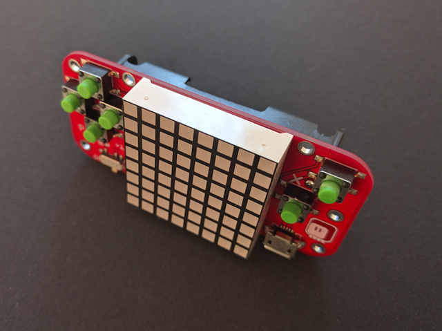

PewPew 10.2
===========

PewPew 10.2 is a standalone version of the PewPew device, designed specifically
to be cheap and simple to use in workshop settings. You only need two AAA
batteries and a micro-USB cable (with a computer to plug it into) to start
using it.

.. toctree::
    :maxdepth: 2

    hardware.rst
    assembly.rst
